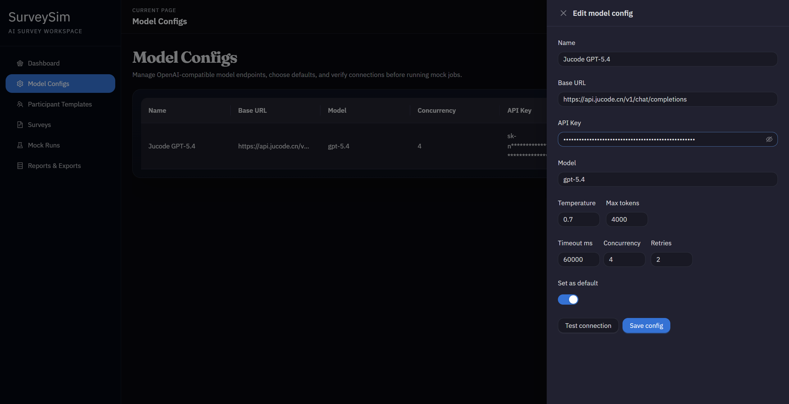
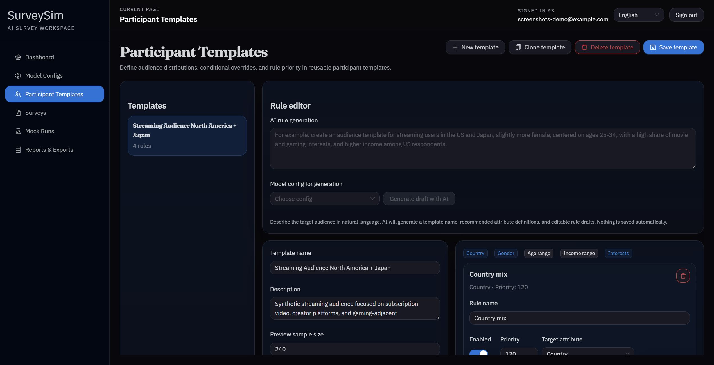
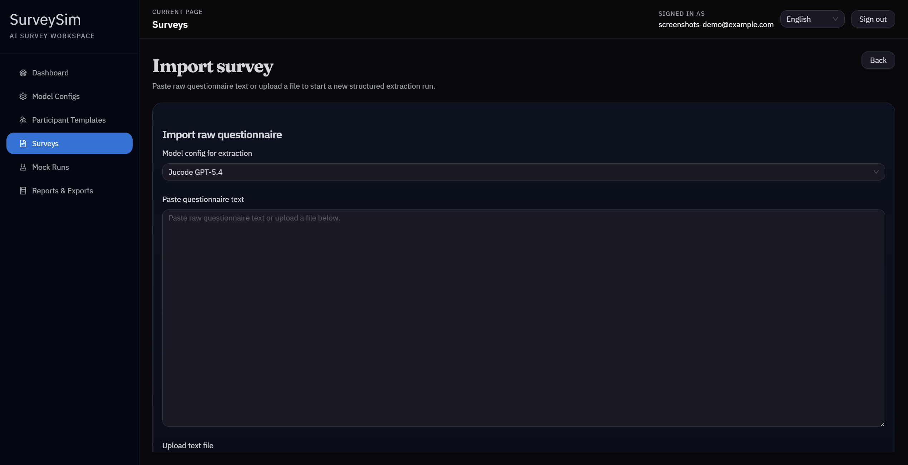
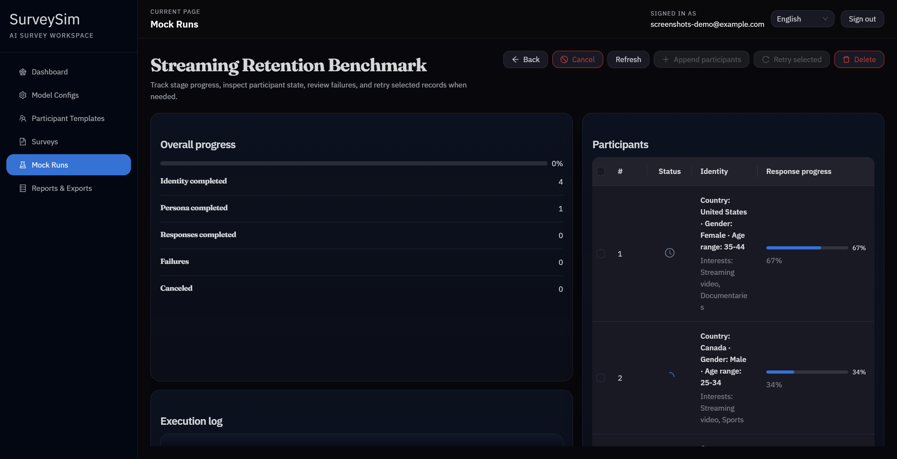
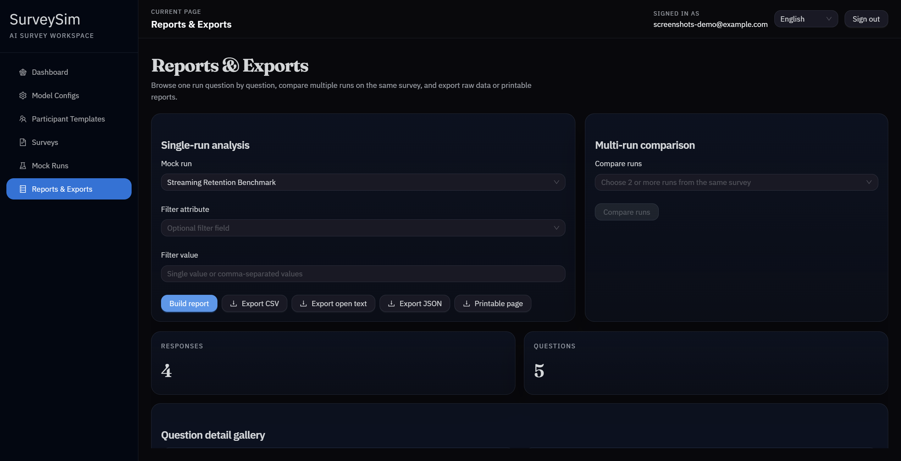
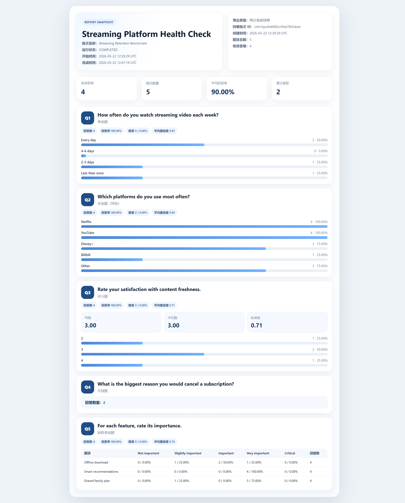

# SurveySim

SurveySim is an open-source web application for simulating survey respondents with LLMs.

It helps teams turn raw questionnaires into structured survey schemas, define target populations, run large-scale mock response batches, and review the results through reports and exports.

## Why SurveySim

SurveySim is designed for product teams, UX researchers, and operations teams who want a fast way to pressure-test questionnaires and response patterns before launching research workflows at scale.

It combines survey structuring, participant modeling, simulation runs, and reporting in one workspace instead of spreading them across scripts and ad hoc tools.

## Highlights

- OpenAI-compatible LLM provider configuration
- Participant template builder with rule-based audience modeling
- Raw survey import and structured extraction workflow
- Batch simulation for identity, persona, and survey response generation
- Run monitoring, retry flow, reporting, and export tools
- Full-stack TypeScript monorepo with shared schemas

## Screenshots

### LLM configuration workspace

Configure OpenAI-compatible providers, set defaults, and tune request limits in one place.



### Participant template builder

Define target audience dimensions, draft AI-assisted rules, and refine weighted distributions in the visual editor.



### Survey import flow

Paste raw questionnaire text, choose an extraction model, and prepare a structured survey import from a single intake screen.



### Live mock run execution

Track participant generation progress, inspect execution logs, and review identity-level state while a simulation batch is running.



### Result analysis and exports

Review response distributions, open-text samples, matrix summaries, and export-ready analytics from a completed run.



### Printable report output

Generate a clean printable summary page for completed runs, including top-level metrics and question-by-question result snapshots.



## Tech Stack

- Frontend: React, Vite, TypeScript, Ant Design
- Backend: Fastify, Prisma, TypeScript
- Database: MySQL
- Shared package: Zod schemas and DTOs

## Repository Structure

```text
frontend/   React application
backend/    Fastify API and Prisma schema
shared/     Shared types, DTOs, and validation schemas
```

## Getting Started

### Prerequisites

- Node.js 20+
- pnpm 10+

### Install

```bash
pnpm install
```

### Environment

Copy the example environment file:

```bash
cp backend/.env.example backend/.env
```

At minimum, set:

```env
JWT_SECRET=replace-with-a-strong-secret
DATABASE_URL=mysql://<user>:<password>@<host>:<port>/<database>
```

### Initialize the database

```bash
pnpm db:generate
pnpm db:push
```

### Start development

```bash
pnpm dev
```

- Frontend: `http://localhost:5173`
- Backend API: `http://localhost:3123`

## Build

```bash
pnpm build
```

Run the backend after build:

```bash
pnpm --filter @surveysim/backend start
```

## Development

Useful workspace commands:

```bash
pnpm dev
pnpm build
pnpm lint
pnpm test
pnpm db:generate
pnpm db:push
pnpm db:studio
```

## Core Workflows

### 1. Configure model providers

Add one or more OpenAI-compatible LLM endpoints, test connectivity, and choose a default provider for downstream tasks.

### 2. Define participant templates

Build reusable audience templates with demographic and behavioral rules, weighted distributions, and scoped overrides.

### 3. Import surveys

Paste raw questionnaire text or upload text files, then review structured extraction results before saving.

### 4. Run simulations

Create a simulation batch by selecting a participant template, a survey, and an LLM configuration.

### 5. Analyze and export

Inspect run progress, review generated responses, compare runs, and export results as JSON, CSV, or HTML.

## Deployment

SurveySim can be deployed as a single backend process that also serves the built frontend assets.

### Recommended setup

- Linux server
- Node.js 20+
- pnpm 10+
- PM2 for process management
- Nginx for reverse proxy

### Example deployment flow

```bash
git clone <your-repo-url> /srv/surveysim
cd /srv/surveysim
pnpm install --frozen-lockfile
cp backend/.env.example backend/.env
pnpm db:generate
pnpm db:push
pnpm build
cd backend
pm2 start dist/index.js --name surveysim
```

### Example Nginx config

```nginx
server {
  listen 80;
  server_name your-domain.com;

  client_max_body_size 50m;

  location / {
    proxy_pass http://127.0.0.1:3123;
    proxy_http_version 1.1;
    proxy_set_header Host $host;
    proxy_set_header X-Real-IP $remote_addr;
    proxy_set_header X-Forwarded-For $proxy_add_x_forwarded_for;
    proxy_set_header X-Forwarded-Proto $scheme;
  }
}
```

## Data and Runtime Files

By default, SurveySim stores runtime data in:

- `backend/storage/runtime/`
- `backend/.env`

In production, make sure your MySQL database and `backend/storage/runtime/` are backed up.

## Contributing

Issues and pull requests are welcome.

If you plan to make a larger change, open an issue first so the direction can be discussed before implementation.

## Roadmap

- Improve import robustness for more questionnaire formats
- Expand reporting and comparison capabilities
- Add more observability around long-running generation tasks
- Support alternative production database backends

## License

This project is licensed under the GNU General Public License v3.0.

See the [LICENSE](/e:/Code/Projects/FormAgents/LICENSE) file for the full text.
